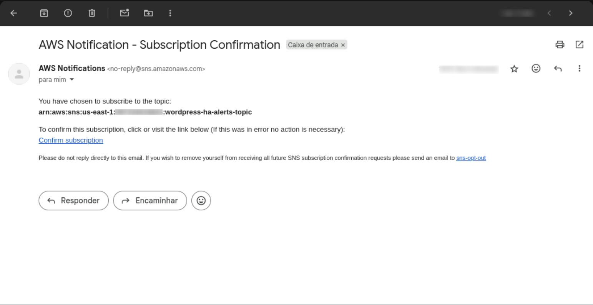
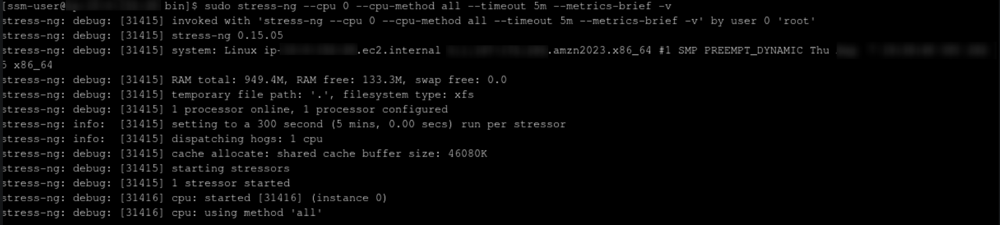
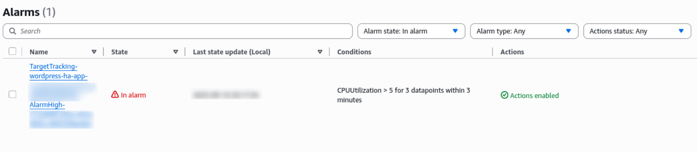
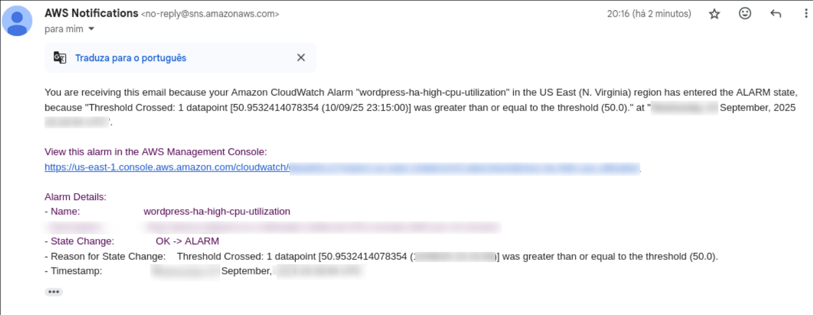
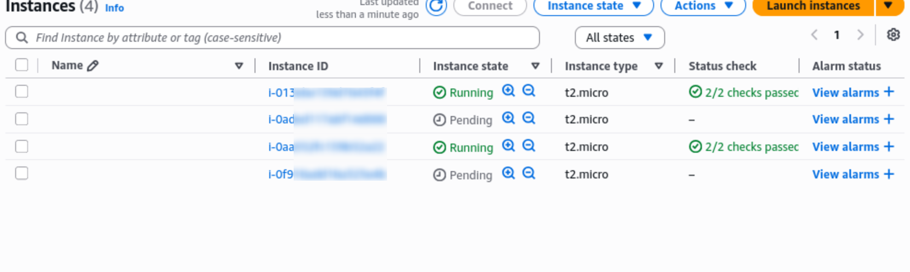
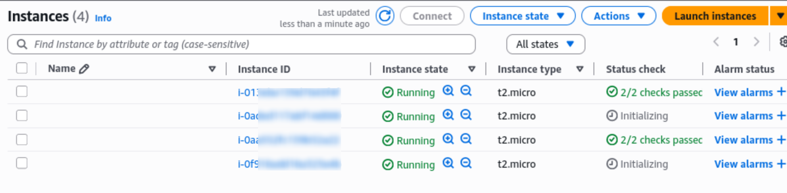
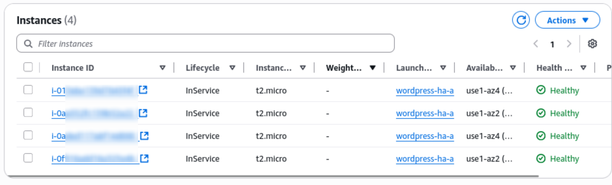

# Projeto WordPress de Alta Disponibilidade na AWS com Terraform

Este projeto implementa uma infraestrutura de alta disponibilidade para um servidor WordPress na AWS, utilizando Terraform para a automação da Infraestrutura. A arquitetura é desenhada para ser segura, escalável e resiliente, seguindo as melhores práticas da AWS.

## Principais Funcionalidades

* **Alta Disponibilidade:** Utiliza múltiplas Zonas de Disponibilidade (AZs) para a base de dados (Amazon RDS), instâncias de computação (EC2) e sistema de ficheiros (EFS), garantindo que a aplicação permaneça online mesmo em caso de falha de uma AZ.
* **Escalabilidade Automática:** O Auto Scaling Group ajusta automaticamente o número de instâncias EC2 com base na utilização da CPU, garantindo o desempenho durante picos de tráfego e a otimização de custos em períodos de baixa atividade.
* **Segurança em Camadas:** A infraestrutura é dividida em sub-redes públicas e privadas. Apenas o Application Load Balancer fica na camada pública, enquanto as instâncias WordPress, a base de dados e o sistema de ficheiros estão protegidos em sub-redes privadas, sem acesso direto da Internet. As regras de firewall são geridas por Security Groups específicos para cada serviço.
* **Gestão Simplificada:** O acesso às instâncias é feito de forma segura através do AWS Systems Manager (SSM) Session Manager, eliminando a necessidade de gerir chaves SSH e expor a porta 22 publicamente (exceto para o IP do administrador).
* **Monitoramento e Alertas:** Um alarme do CloudWatch monitoriza a utilização média da CPU do Auto Scaling Group. Se a utilização exceder um limite predefinido, uma notificação é enviada por e-mail através do Amazon SNS, permitindo uma ação proativa.
* **Armazenamento Partilhado e Persistente:** O Amazon EFS é utilizado para armazenar os ficheiros do WordPress (`/var/www/html`), garantindo que todas as instâncias partilhem o mesmo conteúdo de forma consistente e persistente.

## Arquitetura

A infraestrutura é implementada numa arquitetura de três camadas para garantir a separação de responsabilidades e a segurança:

1.  **Apresentação (Pública):** Contém o Application Load Balancer (ALB), que serve como ponto de entrada para todo o tráfego.
2.  **Negócios (Privada):** Contém as instâncias EC2 que executam a aplicação WordPress em contentores Docker. Estas instâncias são geridas por um Auto Scaling Group para garantir a escalabilidade e a resiliência.
3.  **Dados (Privada):** Contém a base de dados Amazon RDS (MySQL) e o sistema de ficheiros partilhados Amazon EFS, que armazena os ficheiros do WordPress.

## Estrutura do Projeto

O projeto utiliza uma estrutura modular para separar a lógica específica de cada componente.

```
.
|-- environments/
|   |-- testing/
|   |   |-- main.tf         # Chama o módulo e define as variáveis
|   |   `-- testing.tfvars  # Valores específicos para o ambiente de teste
|   |
|   `-- production/
|       |-- main.tf
|       `-- production.tfvars
|
|-- modules/
|   `-- aws-wordpress-ha/
|       |-- variables.tf    # Definição de todas as variáveis
|       |-- outputs.tf      # Saídas de informações (ex: DNS do ALB)
|       |-- network.tf      # VPC, Sub-redes, Gateways, Tabelas de Rota
|       |-- security.tf     # Todos os Security Groups
|       |-- database.tf     # Base de Dados RDS e Subnet Group
|       |-- efs.tf          # Sistema de Ficheiros EFS e Mount Targets
|       |-- compute.tf      # Launch Template e Auto Scaling Group
|       |-- alb.tf          # Application Load Balancer e Target Group
|       |-- iam.tf          # IAM Role e Instance Profile para as EC2
|       `-- user-data.sh    # Script de bootstrap para as instâncias EC2
|
`-- .gitignore
```

## Pré-requisitos

Antes de iniciar, precisa-se que o seguinte esteja instalado e configurado:

  * **Terraform:** 
  * **AWS CLI:** Com as credenciais de um utilizador IAM configuradas.
  * **Permissões IAM:** O utilizador IAM que executa o Terraform precisa de permissões para criar todos os recursos descritos nos ficheiros `.tf`, incluindo `VPC`, `EC2`, `RDS`, `EFS`, `ALB`, `Auto Scaling`, `IAM Roles`, etc. A permissão `iam:PassRole` é essencial para associar o Instance Profile às instâncias EC2.


## Configuração

Toda a configuração é feita através do `.tfvars`. Para cada ambiente (ex: `testing`), existe um aquivo (`testing.tfvars`) onde pode-se definir valores para as variáveis declaradas em `variables.tf`.

**Exemplo de arquivo `testing.tfvars`:**

```tf
environment = "testing"
admin_ip    = "SEU_IP_PUBLICO/32"
db_password = "UmaSenhaMuitoDificil!"

custom_tags = {
  Name       = "WordPress-App"

asg_scale_up_target_value = 60
ec2_asg_min_size = 1
alb_healthy_threshold = 2
ec2_instance_type = t3.micro
...
}
```

Se quiser que certas informações sejam fornecidas no terminal do Terraform é necessario especificar no main do ambiente em questão, foi predefinido valores output de informações uteis como id de efs, link do dns e etc.

Exemplo de output de ambiente: 
  ```terraform
  output "alb_dns_name" {
  description = "DNS public name for the Load Balancer."
  value       = module.wordpress_app.alb_dns_name
  }
  ```

As variáveis vêm configuradas com valores padrão de acordo com a especificação do projeto. Variáveis sensíveis, como a senha do banco de dados, não foram definidas por motivos óbvios.

## Como fazer Deploy

1.  Navegue para o diretório do ambiente que deseja subir:

    ```bash
    cd environments/ambiente
    ```

2.  Inicialize o Terraform para instalar os providers necessários.

    ```bash
    terraform init
    ```

3.  Gere um plano de execução para verificar os recursos que serão criados:

    ```bash
    terraform plan -var-file="ambiente.tfvars"
    ```

4.  Se concordar com o plano apresentado, execute o comando seguinte para criar a infraestrutura:

    ```bash
    terraform apply -var-file="ambiente.tfvars"
    ```

    O Terraform irá pedir uma confirmação final.

## Acessando à Aplicação

  * **WordPress:** Após a conclusão do `apply`, Se você tiver configurado no ambiente, irá mostrar no terminal do terraform o DNS do Application Load Balancer. Cole o endereço  apresentado no navegador para acessar instalação do WordPress.
  
  * **Instâncias EC2:** O acesso direto via SSH não é necessário. Para acessar a uma instância para fins administrativos, utilize o **AWS Systems Manager (SSM) Session Manager** a partir do consola da AWS. Ademais, ainda existe a possibilidade de criar um bastion host na mesma VPC e fazer o jump por ele, porém ele só aceita o endereço do administrador definido.

## Destruir a Infraestrutura

Para remover todos os recursos criados e evitar custos:

```bash
terraform destroy -var-file="testing.tfvars"
```

-----

## Extras
### Validando a Escalabilidade do ASG e Monitoramento com CloudWatch

Demonstração como a funcionalidade de auto-scaling e os alertas configurados foram testados para validar a resiliência da arquitetura.

### 1\. Configuração dos Alertas

Após a aplicação do Terraform, um tópico SNS é criado para enviar notificações. É necessário confirmar a subscrição no e-mail fornecido (`var.notification_email`) para começar a receber os alertas.



### 2\. Simulação de Aumento de Carga

Para testar a política de escalabilidade do Auto Scaling Group (ASG), foi simulado um aumento na utilização da CPU. Isto foi feito acedendo a uma das instâncias EC2 via AWS SSM Session Manager e executando a ferramenta `stress-ng` para sobrecarregar os processadores.



### 3\. Ativação do Alarme no CloudWatch

O aumento da carga de CPU, monitorizado pelo CloudWatch, fez com que o limiar do alarme (`cloudwatch_threshold`, por exemplo 50%) fosse ultrapassado, mudando o seu estado para "In alarm".



### 4\. Notificação de Alerta por E-mail

Assim que o alarme foi acionado, o serviço SNS enviou uma notificação para o e-mail configurado.



### 5\. Ação do Auto Scaling Group (Scale-Up)

O estado "In alarm" da política de Target Tracking acionou o Auto Scaling Group para executar uma ação de "scale-up", ou seja, aumentar o número de instâncias para lidar com a carga. O processo de lançamento de novas instâncias pode ser observado na consola do EC2, passando pelos estados "Pending", "Initializing" até "Running".

  * **Início do Scale-Up:** Duas novas instâncias entram no estado "Pending".

    

  * **Instâncias em Inicialização:** As novas instâncias mudam para o estado "Running" e começam o processo de inicialização.


  * **Todas as Instâncias em Execução:** Todas as quatro instâncias estão agora no estado "Running".
   
    


### 6\. Verificação do Estado no Auto Scaling Group

Finalmente, na consola do Auto Scaling Group, é possível verificar que as quatro instâncias estão registadas, com o estado "Healthy" e "InService", confirmando que o processo de scale-up foi concluído com sucesso e a capacidade da aplicação foi expandida para suportar o aumento de tráfego.

  

## Explicação Detalhada dos Componentes

### 1\. Rede (`network.tf`)

Define a infraestrutura de rede na AWS:

  * **`aws_vpc`**: Cria a Virtual Private Cloud, o contentor principal para todos os recursos de rede, com um bloco CIDR definido pela variável `vpc_cidr` (padrão: `10.0.0.0/16`).
  * **Sub-redes:**
      * **Sub-redes Públicas (`aws_subnet.public_subnets`)**: Cria sub-redes em diferentes Zonas de Disponibilidade (AZs). Estas sub-redes são "públicas" porque as suas tabelas de rota têm um caminho para o Internet Gateway. O Application Load Balancer e os NAT Gateways residem aqui.
      * **Sub-redes Privadas (`aws_subnet.private_subnets`)**: Cria sub-redes em diferentes AZs para as instâncias EC2 e a base de dados. Estas não têm acesso direto à Internet, garantindo maior segurança.
  * **Gateways:**
      * **`aws_internet_gateway` (IGW)**: Permite a comunicação bidirecional entre a VPC e a Internet. É associado à tabela de rotas das sub-redes públicas.
      * **`aws_nat_gateway` (NAT Gateway)**: É provisionado nas sub-redes públicas e permite que os recursos nas sub-redes privadas (como as instâncias EC2) iniciem ligações para a Internet (ex: para atualizações de pacotes), mas impede que a Internet inicie ligações para eles.
* **Tabelas de Rota (`aws_route_table`)**:
    * **Pública (`public_route`)**: Direciona todo o tráfego para o Internet Gateway.
    * **Privada (`private_route`)**: Direciona o tráfego de saída para os NAT Gateways.

### 2\. Segurança (`security.tf`)

Define as regras de Security Group para controlar o tráfego entre os recursos:

  * **`lb_sg` (Load Balancer):** Permite a entrada de tráfego HTTP (porta 80) de qualquer lugar (`0.0.0.0/0`).
  * **`ec2_sg` (Instâncias EC2):**
      * Permite a entrada de tráfego na porta 80 apenas a partir do Load Balancer.
      * Permite a entrada de tráfego na porta 22 (SSH) apenas a partir do seu `admin_ip` para gestão.
      * Permite a saida para o RDS e EFS.
  * **`rds_sg` (Base de Dados):** Permite a entrada na porta 3306 (MySQL) apenas a partir das instâncias EC2.
  * **`efs_sg` (Sistema de Ficheiros):** Permite a entrada na porta 2049 (NFS) apenas a partir das instâncias EC2.

### 3\. Dados(`database.tf`)

Configura o banco de dados:

  * **`aws_db_instance`:** Cria uma instância RDS com MySQL. Parâmetros como tipo de instância, armazenamento e versão são definidos por variáveis. A instância é implementada nas sub-redes privadas e não é acessível publicamente (`publicly_accessible = false`), garantindo a segurança.
  * **`aws_db_subnet_group`:** Agrupa as sub-redes privadas onde a instância RDS pode ser colocada.

### 4\. Elastic File System (`efs.tf`)

Configura o sistema de arquivos elástico para os dados do WordPress:

  * **`aws_efs_file_system`:** Cria um sistema de arquivos elástico (EFS) que é encriptado por padrão (`efs_encrypted = true`).
  * **`aws_efs_mount_target`:** Cria um ponto de montagem em cada uma das sub-redes privadas, permitindo que todas as instâncias EC2, independentemente da Zona de Disponibilidade, tenham acesso aos dados.

### 5\. Computação (`compute.tf`)

Define as instâncias virtuais e a sua escalabilidade:

  * **`aws_launch_template`:** É o "molde" para as instâncias EC2. Define a AMI, o tipo de instância, o par de chaves, o perfil IAM, as regras de rede e o script `user-data`.
  * **`aws_autoscaling_group`:** Controla o ciclo de vida das instâncias EC2. Garante que o número desejado de instâncias está sempre a ser executado e lança novas instâncias nas sub-redes privadas se alguma falhar ou se for necessário escalar.
  * **`aws_autoscaling_policy`**: Define a política de escalabilidade do tipo `TargetTrackingScaling` usando  a utilização média de CPU (`ASGAverageCPUUtilization`) como critério de escalabilidade.
  * **`aws_cloudwatch_metric_alarm` e `aws_sns_topic`**: Cria um alarme que monitora a utilização de CPU. Se a métrica exceder o limite definido, o alarme envia um email.

### 6\. Balanceador de Carga (`alb.tf`)

Distribui o tráfego de entrada:

  * **`aws_lb`:** Cria um Application Load Balancer (ALB) do tipo "internet-facing" nas sub-redes públicas.
  * **`aws_alb_target_group`:** Agrupa as instâncias EC2 saudáveis. Realiza verificações de saúde (`health checks`) para garantir que o tráfego só é enviado para instâncias que estão funcionando corretamente.
  * **`aws_lb_listener`:** "Ouve" o tráfego na porta 80 e encaminha-o para o Target Group.

### 7\. IAM (`iam.tf`)

Controla as permissões para os serviços da AWS:

  * **`aws_iam_role` e `aws_iam_instance_profile`:** Cria uma role com uma política de confiança que permite que as instâncias EC2 a assumam.
  * **`aws_iam_role_policy_attachment`:** Anexa a política gerida `AmazonSSMManagedInstanceCore` à role, o que permite o acesso seguro às instâncias através do SSM Session Manager.

### 8\. Bootstrap (`user-data.sh`)

Este script é executado automaticamente em cada instância EC2 quando ela é iniciada:

1.  **Atualiza o sistema** e instala as dependências necessárias (Docker, EFS utils).
2.  **Inicia o serviço Docker** e adiciona o utilizador `ec2-user` ao grupo do Docker.
3.  **Instala o Docker Compose**.
4.  **Monta o EFS** no diretório especificado e configura o `/etc/fstab` para montagem automática.
5.  **Cria o ficheiro `docker-compose.yml`**, injetando dinamicamente as variáveis passadas pelo Terraform (como o endpoint da base de dados).
6.  **Inicia o container do WordPress** usando o `docker-compose`.